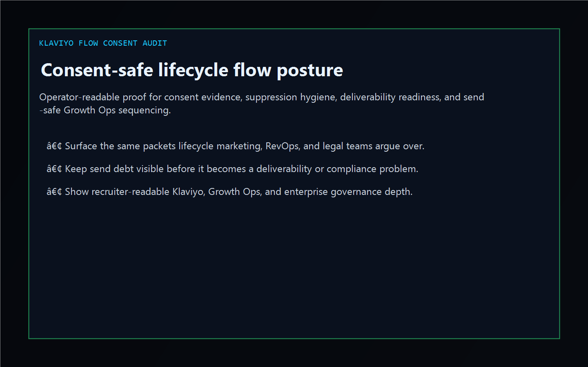
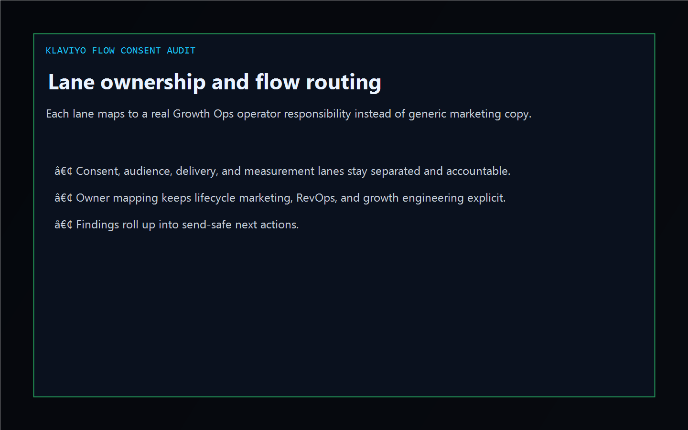
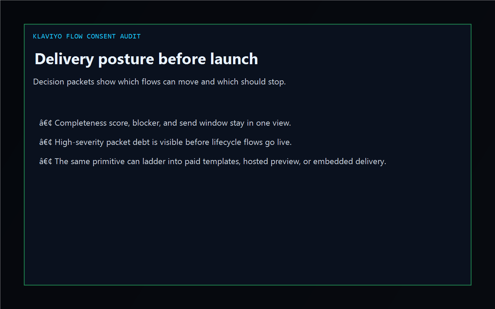

# Klaviyo Flow Consent Audit

[](https://github.com/mizcausevic-dev/klaviyo-flow-consent-audit/actions/workflows/ci.yml)
[](https://github.com/mizcausevic-dev/klaviyo-flow-consent-audit/actions/workflows/pages.yml)
[](https://github.com/mizcausevic-dev/klaviyo-flow-consent-audit/releases/tag/v0.1-shipped)

TypeScript control plane for Klaviyo-flavored consent evidence, audience suppression hygiene, deliverability readiness, and send-safe lifecycle flow sequencing.

Live surface:

- [flows.kineticgain.com](https://flows.kineticgain.com/)

## Why this exists

- Growth teams often split consent proof, audience suppression logic, deliverability sign-off, and attribution readiness across lifecycle marketing, data, RevOps, and legal.
- B2B operators still need one review-safe picture before a high-volume lifecycle flow, winback motion, or promotional campaign goes wide.
- This surface turns synthetic Klaviyo-flavored flow, packet, and exception exports into lane, gap, and delivery posture evidence without pretending to be a live tenant control plane.

## Why this matters

This repo demonstrates the Growth Ops consent-audit primitive for enterprise buyers: consent evidence tied to missing suppressions, stale audience packets, deliverability blockers, and send-safe escalation paths. A buyer would care because lifecycle revenue systems often need operator-readable evidence without exposing live customer records or write-heavy production tenants. Kinetic Gain Embedded extends this into security-first in-product analytics for consent-aware and delivery-aware workflows, see [kineticgain.com/embedded](https://kineticgain.com/embedded).

## Monetization ladder

- Tier 1 now: public repo, dashboard, analyzer, and docs surface
- Tier 2 planned: paid flow audit templates, consent evidence packs, and deliverability readiness checklists
- Tier 3 contingent: hosted preview when product rail and billing are ready
- Tier 4 by engagement: embedded Growth Ops governance and evidence-routing delivery

## Surface map

- `/`
- `/flow-lane`
- `/consent-gaps`
- `/delivery-posture`
- `/verification`
- `/docs`

Structured APIs:

- `/api/dashboard/summary`
- `/api/flow-lane`
- `/api/consent-gaps`
- `/api/delivery-posture`
- `/api/verification`
- `/api/sample`

## Screenshots





## Local usage

```powershell
git clone https://github.com/mizcausevic-dev/klaviyo-flow-consent-audit.git
cd klaviyo-flow-consent-audit
npm install
npm run verify
npm run prerender
npm run render:assets
```

Start the local server:

```powershell
npm run dev
```

Useful routes:

- [http://127.0.0.1:5524/](http://127.0.0.1:5524/)
- [http://127.0.0.1:5524/flow-lane](http://127.0.0.1:5524/flow-lane)
- [http://127.0.0.1:5524/consent-gaps](http://127.0.0.1:5524/consent-gaps)

CLI example:

```powershell
npx klaviyo-flow-audit fixtures/klaviyo-flow-consent-clean.json --format summary
```

## Release discipline

| Guardrail | Posture |
| --- | --- |
| Data handling | Synthetic, non-customer-identifying flow and packet snapshots only. No live tenant, list, or event-stream credentials. |
| Deploy | Static prerender -> **https://flows.kineticgain.com/** (GitHub Pages, [pages workflow](./.github/workflows/pages.yml)) |
| SEO | `robots.txt`, `sitemap.xml`, canonical routes, and crawlable docs included |
| Theme | Dark Kinetic Gain operator shell aligned to the current public dashboard standard |
| Tests | `npm run verify` covers lint, typecheck, vitest coverage, build, demo, and smoke |

## Platform note

This is an independent operator-surface demonstration for teams working with Klaviyo, lifecycle marketing, consent governance, and growth-ops workflows. It is not an official vendor site, SDK, or tenant integration.
